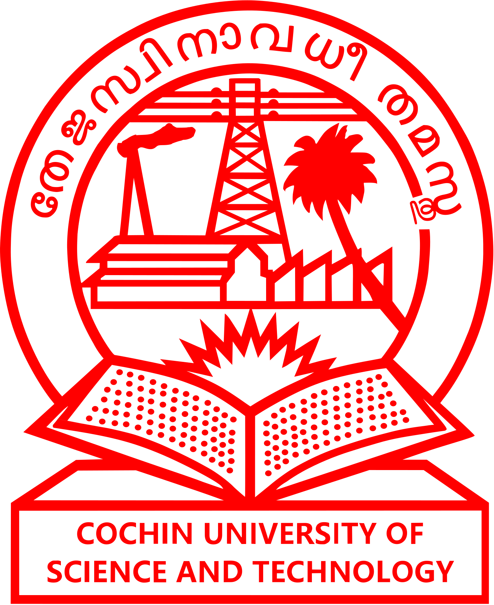
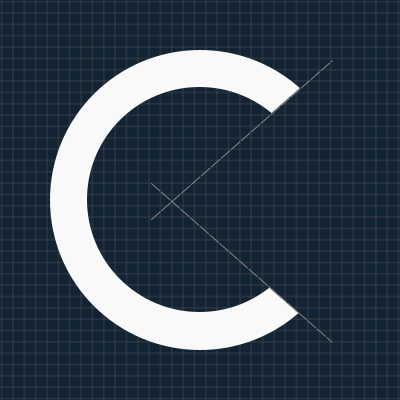
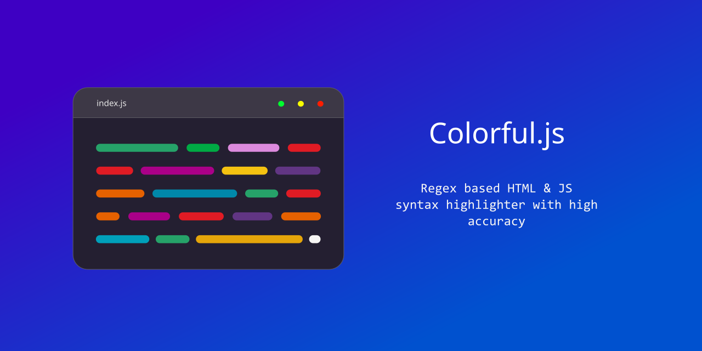

# Inkscape-works

Repository of my inkscape works

## Raster previews

### [ECSA Logo competition poster](https://www.instagram.com/p/C6lw1hzvfZC/)
 

### ECSA logo - my try (didn't qualified :))
 

### CUSAT logo (bitmap trace + reworked)
 

### IC pinout sheet
 

### [C](https://roopesh2.github.io/C)
 

### [syntax highlighter conver](https://roopesh2.github.io/Colorful)
 

### A random pending work
 
